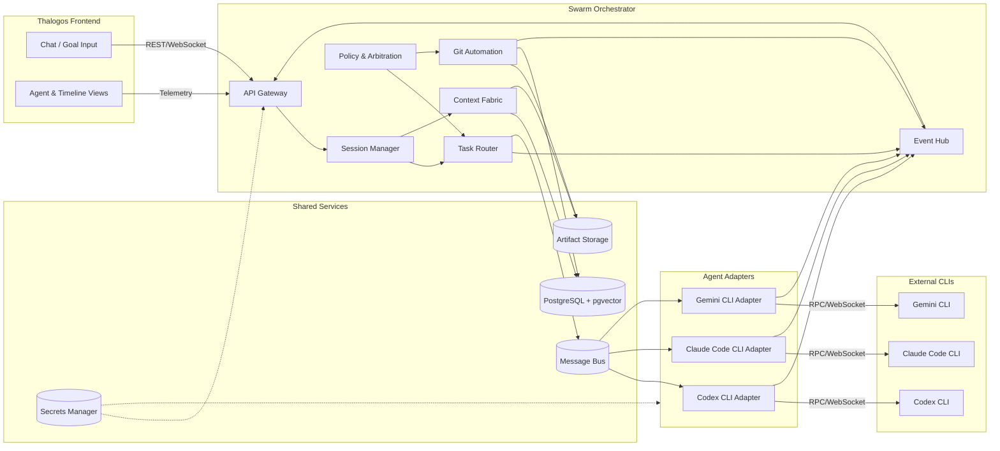

# Swarm Orchestration Architecture (Draft)

## Purpose
This document sketches the initial architecture for turning Thalogos into the user interface for a multi-agent development swarm. It identifies the core components, their responsibilities, shared infrastructure, and how agent adapters (Codex CLI, Claude Code CLI, Gemini CLI) interact through the orchestrator layer.

## High-Level Overview
- Thalogos remains the primary UI/UX layer, offering chat, agent dashboards, timeline controls, and the proposed "Save" checkpoint interactions.
- A Swarm Orchestrator service sits behind the UI, owning session state, task routing, shared memory, git automation, and telemetry.
- Each external CLI runs behind an Agent Adapter that exposes a structured RPC/WebSocket interface to the orchestrator.
- Shared services (message bus, relational DB, vector store, artifact storage) provide durable memory, event streaming, and git workspace access.

## Component Responsibilities

### 1. Thalogos Frontend
- Initiates sessions, captures user goals, and renders agent activity in real time.
- Opens a WebSocket subscription to the orchestrator (`wss://.../sessions/{id}`) plus REST endpoints for historical data and control commands.
- Issues explicit commands: `start_session`, `delegate_task`, `save_checkpoint`, `review_timeline`, `rollback_checkpoint`.
- Displays agent telemetry, task boards, code diffs, merge status, and git lineage returned by the orchestrator.

### 2. Swarm Orchestrator Service
Organized into the following modules:
- **API Gateway**: FastAPI (or equivalent) endpoints for UI calls, WebSocket streams for telemetry, and authenticated bridges for adapters.
- **Session Manager**: Creates sessions, tracks participants, enforces access control, and binds user input to a task graph.
- **Task Router**: Breaks intents into tasks, assigns them to agents based on capability profiles, SLA, and workload, and manages retries.
- **Context Fabric**: Maintains durable knowledge (relational store + embeddings), serves scoped context bundles, and handles summarization/decay.
- **Git Automation Controller**: Manages repository worktrees, branch orchestration, automated merges, conflict resolution strategies, and checkpoint commits.
- **Event Hub**: Publishes task state, agent heartbeats, merge results, and timeline updates to subscribed clients (UI and agents).
- **Policy & Arbitration**: Applies conflict resolution rules, coordinates QA/security approvals, and escalates to humans when necessary.

### 3. Agent Adapters
One adapter per CLI-based agent. Each adapter:
- Manages the CLI process lifecycle and streaming I/O.
- Translates orchestrator requests into CLI commands (e.g., `codex --json --task-id`), capturing stdout/stderr as structured messages.
- Sends periodic health/heartbeat and capability metadata (supported task types, preferred payload shape, limits).
- Provides sandboxed filesystem access if the CLI expects local files, mounting the orchestrator-provisioned workspace.
- Implements cancellation and timeout semantics so the orchestrator can reclaim tasks.

### 4. Shared Services
- **Message Bus**: Redis Streams or NATS JetStream to buffer tasks, responses, and telemetry between orchestrator and adapters.
- **Persistence**: PostgreSQL for relational data (sessions, tasks, timeline), pgvector or similar for semantic search, object storage (S3/minio) for large artifacts.
- **Workspace Volume**: A git-enabled working copy (see Git Automation) exposed to agents via shared volume or API.
- **Secrets & Auth**: Vault or GCP Secret Manager for API keys/CLI credentials; JWT/OAuth tokens propagated from the frontend for user scoping.

## Data & Control Flow
1. **Goal Capture**: User submits a goal via Thalogos; UI sends `start_session` to orchestrator.
2. **Session Initialization**: Orchestrator persists session, seeds timeline, selects initial agents, and returns session metadata + active agents.
3. **Task Decomposition**: On each user prompt or internal trigger, Task Router generates/decomposes tasks and enqueues them per agent.
4. **Agent Execution**: Adapters pull tasks, run the underlying CLI, stream partial outputs back through the event hub, and write artifacts (code diffs, analysis).
5. **Aggregation**: Orchestrator validates outputs (QA, tests if available), updates memory, and synthesizes a user-facing response.
6. **Presentation**: UI receives telemetry and final responses, updates chat, agent status, and optional visualizations (timeline, 3D canvas).
7. **Checkpoint/Git**: On "Save" or automated triggers, Git controller snapshots the repo, merges changes back into the main line if policies allow, and updates the timeline.

## Session Lifecycle States
- `draft`: Session created, awaiting first goal confirmation.
- `active`: Tasks executing, agents engaged.
- `awaiting_review`: Agents paused, awaiting human approval for merges or rollbacks.
- `finalized`: Checkpoint saved, session archived.
- `suspended`: Errors or missing adapters; manual intervention required.

Transitions are driven by user actions, orchestrator policies, or agent completion events.

## Context & Memory Management
- **Long-Term Memory**: Structured decision log with vector summaries for recall; agents query via context selectors.
- **Working Sets**: Ephemeral bundles (files, configs, tests) scoped per task to limit payload size; automatically refreshed when git checkpoint changes.
- **Summarization**: Background jobs keep session size manageable via semantic summarization or aggregation of past decisions.

## Git Automation Integration
- Central bare repository + per-session worktrees managed by the orchestrator.
- Task branches named `session/{id}/task/{uuid}` created for agent work; merges happen into `session/{id}/integration` after QA checks.
- On "Save", orchestrator fast-forwards `main` (or designated release branch) from the integration branch if tests pass, tagging the checkpoint.
- Merge conflicts trigger automated diff analysis; if resolvable by policy (e.g., whitespace, non-overlapping files) orchestrator commits; otherwise escalates to UI for review.
- All git actions are logged to the timeline with author = agent identity + supervising orchestrator.

## Deployment Topology (Initial Draft)
- Containerized orchestrator (FastAPI + Celery-like workers) deployed alongside Redis and PostgreSQL (managed services when possible).
- Agent adapters run as sidecar containers or dedicated nodes closer to the required CLIs; secured via mTLS/WebSocket tokens.
- Thalogos frontend served as static assets (Vite build) hitting orchestrator APIs behind an API gateway/reverse proxy.

## Observability & Resilience
- Structured logging with correlation IDs per session/task.
- Metrics: agent throughput, task latency, merge success rate, git conflict rate, save latency.
- Alerting on heartbeat loss, queue backlogs, merge failures, or repeated rollbacks.
- Graceful degradation: if a CLI adapter is offline, orchestrator reroutes tasks or pauses with actionable UI alerts.

## Security Considerations
- Propagate user identity from Thalogos to orchestrator for audit trails and permission gating.
- Each agent adapter uses least-privilege credentials; no agent receives broader repository access than required.
- Git automation policies enforce review gates for sensitive branches, with optional human approval flags.

## Open Questions / Next Steps
- Finalize task schema and capability descriptors for adapters.
- Decide whether orchestrator synthesizes final chat replies or delegates that role to a specific agent (e.g., Gemini CLI).
- Validate filesystem strategy for CLIs that expect local state; determine if remote execution is viable.
- Prototype heartbeat and reconnection flows for adapters.
